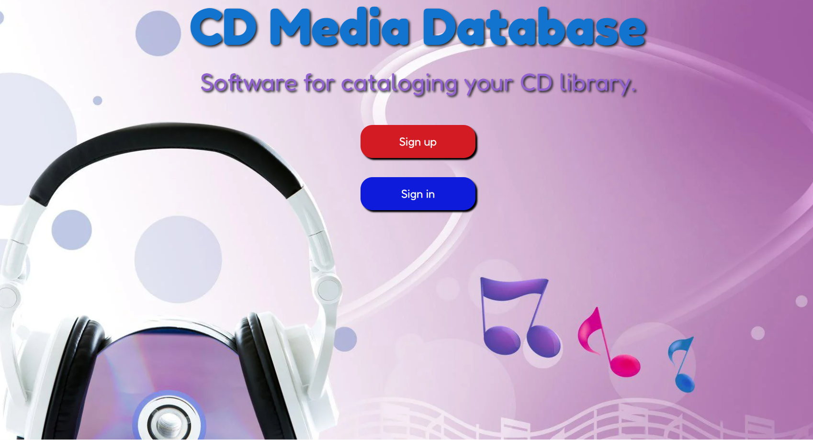
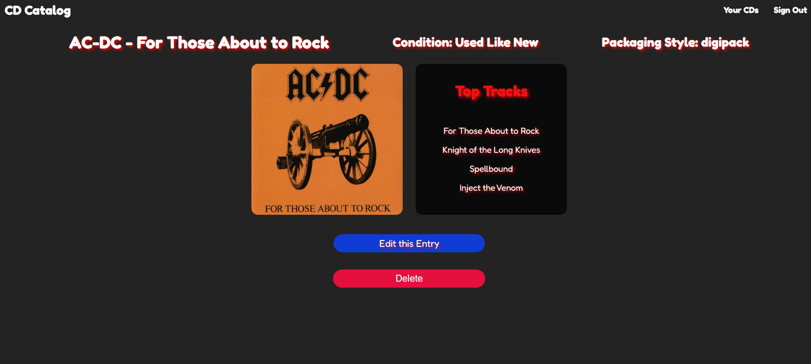

__Home Screen__

__Show Page__

# CD Media Database

This app enables the user to create an account and log into their own personal __CD Media Database__.  Users can __create__, __add__, __delete__, and __edit__ their entries making this a ***Full Crud Application***.  This app allows users to enter the following properties of each of their audio CDs.

 1. __Artist__
 2. __Album__
 3. __Top 4 Favorite Tracks__
 4. __Link to the Album Art__
 5. __Conditon__ 
 6. __Packaging Type__

I came up with the idea to create this application based on my ever growing CD library.  I went shopping for more CDs and ended up buying ***duplicate*** titles which can become ***expensive*** after a few duplicate purchases

The Technologies used in this project are __javascript__, __node.js__, __json__, __CSS__, and __Model-View-Controller (MVC) Framework__.

***In the future***, I plan on adding the ability to add the full track listing of each entry.  Also, another update will include the Genre catagory. The ability to search by artist, album, track, and genre will also be added in the future.  Keep your eyes and ears open for further updates.

__The following is a link to my ***Trello Board*** which shows the planning stages of my project.__

[Trello Planning Board](https://trello.com/invite/b/67d4a00ad57c506cb094388c/ATTI0dd965a07242a0ae50ce0c7527cd7552546F7F90/project-2-trello)

__The following is a link to the deployed application.  To ***create an account*** and try it click on the below link.__

[DEPLOYED Application](https://my-project-2-239d6ad4e34c.herokuapp.com/)

